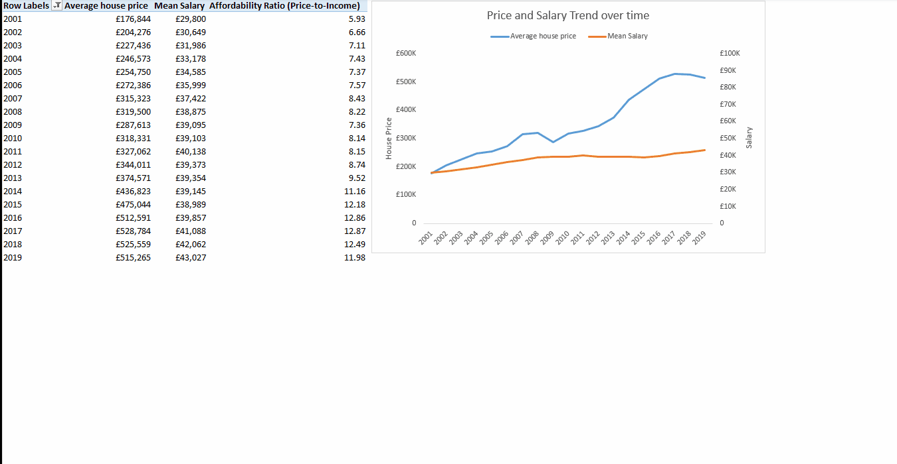

# Data Analytics Portfolio

Welcome! I am a Business Management graduate transitioning into data analytics, focused on transforming data into meaningful business insights.

I am currently building my skills in Excel, SQL, Python, and Power BI while documenting my learning journey through practical projects.

---

## 📊 Featured Projects

### 🛒 Superstore Sales Dashboard

**Project Overview**

An interactive Excel dashboard analyzing retail sales performance, profitability, and discount impact across states and product categories.

**Key Insights**

✔ Identified high-performing product categories  
✔ Revealed loss-making sub-categories  
✔ Showed how discounts affect profitability  
✔ Highlighted seasonal sales trends  

🔗 **[View Project](Superstore_Project/)**

---

### 🏙️ London Housing Market Analysis

**Project Overview**

A housing market analysis exploring property price trends, affordability, crime impact, and demand across London boroughs.

**Key Insights**

✔ Revealed widening gap between salaries and housing prices  
✔ Identified borough affordability differences  
✔ Showed impact of safety on property values  
✔ Highlighted long-term housing demand growth  

🔗 **[View Project](London_Housing_Project/)**

---

## 🛠 Skills Demonstrated

- Excel Dashboards & Data Visualization  
- Power Query (ETL & Data Cleaning)  
- Data Modelling & PivotTables  
- Analytical Thinking & Business Insights  

---

## 🚀 Currently Learning

- SQL  
- Python for Data Analysis  
- Power BI  

---

## 📫 Connect With Me

I am actively seeking an **entry-level Data Analyst role** and welcome opportunities to collaborate or learn.

