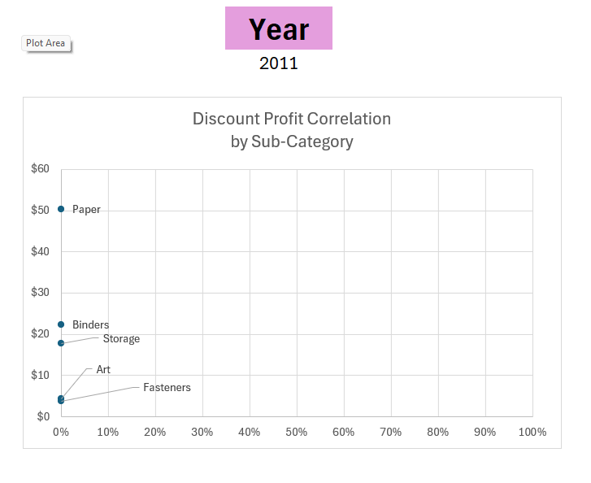
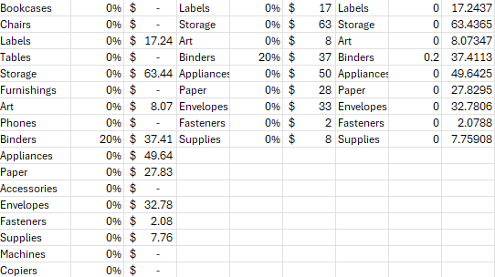

# Excel Superstore Sales Dashboard


## Introduction

This Superstore sales dashboard was created to help users analyze sales performance, profitability, and discount impact across different states, product categories, and time periods.

The dashboard is built using the Superstore dataset and demonstrates how Excel can transform raw retail data into meaningful business insights. It enables users to explore trends, compare performance, and identify opportunities to improve profitability.

### Dashboard File
[Check out my work here!](Project%20Superstore.xlsx)

### Excel Skills Used

The following Excel skills were utilized for analysis:

- **📉 Charts**
- **🧮 Formulas and Functions**
- **📊 PivotTables**
- **❎ Data Validation**

### Superstore Dataset

The dataset used for this project contains retail sales data including:

- **🛍️ Product categories & sub-categories**
- **💰 Sales and profit values**
- **📍 Geographic performance**
- **📅 Order dates & trends**
- **🏷️ Discounts**

---

## Dashboard Build

### 📉 Charts

#### 📊 Monthly Sales & Profit Trend


- 🛠️ **Excel Features:** Line chart displaying monthly sales and profit trends.
- 🎨 **Design Choice:** Dual trend lines allow comparison between revenue and profitability.
- 📈 **Data Organization:** Data grouped by order month for time-based analysis.
- 💡 **Insights Gained:** Highlights seasonal trends and periods where profit declines despite strong sales.

---

#### 🏆 Profit by Sub-Category


- 🛠️ **Excel Features:** Bar chart ranking sub-categories by profit.
- 🎨 **Design Choice:** Sorted bars improve readability and highlight extremes.
- 📉 **Data Organization:** Sub-categories arranged by profitability.
- 💡 **Insights Gained:** Reveals high-performing products and loss-making items.

---

#### 💸 Discount Impact on Profitability



- 🛠️ **Excel Features:** Pivot-based summary used to evaluate discount effects.
- 📊 **Data Representation:** Comparison of profit against discount levels.
- 💡 **Insights Gained:** Higher discounts often correlate with reduced or negative profits.

---

### 🧮 Formulas and Functions

#### 💰 Sales & Profit Aggregation

```excel
=SUMIFS(
Superstore[Profit],Superstore[Sub-Category],Sub_category,
Superstore[State],State,Superstore[Category],
Category,Superstore[Order_year],Year
)
```

- 🔍 **Multi-Criteria Filtering:** Calculates totals based on selected filters.
- 📊 **Dynamic Analysis:** Updates results automatically when selections change.
- 🎯 **Tailored Insights:** Enables targeted performance analysis.

🍽️ Background Table


📉 Dashboard Implementation


---

#### 📅 Monthly Trend Calculation

```excel
=TEXT(Order_Date,"mmm-yyyy")
```

- 📆 **Date Formatting:** Groups transactions by month.
- 📈 **Trend Analysis:** Supports time-series visualizations.

🍽️ Background Table


📉 Dashboard Implementation


---

#### 💸 Discount–Profit Correlation Analysis

```excel
=IFERROR(
AVERAGEIFS(
Superstore[Discount],
Superstore[Sub-Category],$AC2,
Superstore[State],State,
Superstore[Category],Category,
Superstore[Order_year],Year
),
0)
```

- 🔍 **Multi-Criteria Filtering:** Calculates the average discount for each sub-category based on selected State, Category, and Year.
- 📊 **Error Handling:** `IFERROR()` ensures the formula returns 0 when no matching data exists.
- 📉 **Analytical Purpose:** Provides the discount values used to evaluate the relationship between discount levels and profitability.
- 🎯 **Business Insight:** Helps identify where excessive discounting may be reducing profit margins.

🍽️ Background Table



📉 Dashboard Implementation


---

### ❎ Data Validation

#### 🔍 Interactive Filters

- 🔒 **Enhanced Data Validation:** Dropdown filters for State, Category, and Year ensure:
  - 🎯 Accurate and consistent selections  
  - 🚫 Prevention of incorrect entries  
  - 👥 Improved dashboard usability  


---

## Conclusion

This dashboard showcases insights into retail sales performance and profitability. Using Excel’s analytical and visualization tools, it helps users understand trends, evaluate discount strategies, and identify high-performing products and regions.

Exploring the dashboard demonstrates how Excel can transform raw business data into clear, actionable insights that support data-driven decision-making.
